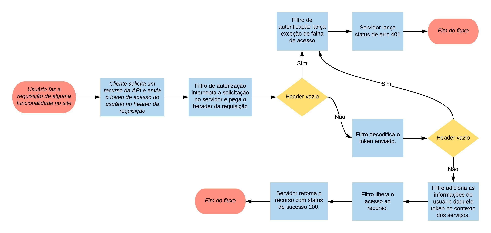

# Logan JavaEE
Desenvolvimento de um login em uma API RESTFull construída em JavaEE usando JWT.

## Tecnologias
1. Java
2. JavaEE
3. Java Web Token (JWT)

## Informações gerais
A prosta deste repositório é apresentar o desenvolvimento de um **login simples** em uma API RESTFull JavaEE, orientada a Token.

O que queremos é que o cliente solicite à API uma credencial de acesso a partir dos seus dados de login (neste caso, email e senha) e receba um token de acesso que deve ser enviado em todas as requisições protegidas da API.

## Desenvolvimento da aplicação
A aplicação foi dividida em duas etapas: a **autenticação** (credenciar o usuário) e **autorização** (verificar se o usuário está autenticado).

### Autenticação
Para realizar o login, a aplicação se comporta como mostra o diagrama de fluxo da Figura 1 a seguir:

Sabendo disso, essa interação foi dividida nas seguintes classes princiais: 

1. **UsuarioController**: Classe de controle que recebe a requisição do cliente com as informações para acesso do usuário, envia para o serviço fazer a autenticação (gerar token de acesso) e retorna esse token ao cliente (ou o status 401, caso ele não tenha acesso); 

2. **UsuarioService**: Classe de negócio que recebe as credenciais do usuário (email e senha) provindas do controlador e envia para o repositório para buscar o usuário com aquelas credencias. Caso exista um usuário com aquele email e senha, esse serviço chama a classe **JWTUtil** para gerar o token de acesso e envia-o para o controlador. Se não houver um usuário com essas credenciais, retorna uma exceção;

3. **Usuário Repository**: Classe de acesso ao banco de dados que busca e retorna o usuário com o email e senha enviados do serviço;

4. **JWTUtil**: Classe de apoio responsável por gerar e retornar o token de acesso.

O diagrama de comunicação da Figura 2 a seguir, ilustra melhor essa interação.

#### Autorização
Com o usuário autenticado e o cliente de posse do token, é necessário que as rotas da aplicação estejam protegidas para serem acessadas somente por quem possua esse token de acesso. Para isso, trabalhamos com as classes presentes no pacote `br.ufrn.imd.logan.security`. 

Primeiramente, podemos ilustrar o fluxo de interação dessa função com a Figura 3 a seguir:

As classes atuantes nessa função foram

1. **Secured**: Interface de definição de uma anotação utilizada para aplicar o filtro nas rotas que forem necessárias a proteção;

2. **AuthenticationFilter**: Classe que implementa a classe de ContainerRequestFilter que implementa o filtro de autorização (basicamente pega o token, decodifica e da o acesso ao usuário);

3. **AuthenticatedUser**: Uma interface de definição de anotação responsável por gerar o usuário logado para que possa ser injetado no container EJB.

4. **AuthenticatedUserProducer**: Classe que implementa a anotação definida como `@AuthenticatedUser` e produz o usuário a ser injetado no container a partir do login obtido do token. Em linhas gerais, quando o `AuthenticationFilter` decodifica o token, ele adiciona o login do usuário em um atributo definido como um `Event<String>` que usa a notação `@AuthenticatedUser`. Esse evento dispara o uso da classe `AuthenticatedUserProducer`, a qual busca o usuário com aquele login e cria uma instância dele que pode ser injetado em qualquer controlador. Essa injeção pode ser observada, nesse caso, na classe `UsuarioController`.

Para uma explicação mais aprimorada do desenvolvimento dessa funcionalidade, consulte [este tutorial](https://stackoverflow.com/questions/26777083/best-practice-for-rest-token-based-authentication-with-jax-rs-and-jersey), que eu usei como base para o meu desenvolvimento.

## Executando a aplicação
Inicialmente, clone esse repositório na sua máquina e  importe esse projeto para o Eclipse JavaEE.

Tenha certificado de que haja um servidor Wildfly criado e funcionando normalmente e lembre de criar a conexão com seu banco de dados pela ferramenta de administração do seu servidor Wildfly (este projeto apenas referencia essa conexão previamente criada). O nome da base de dados que estamos trabalhando é **logan**. Mas você pode mudar isso quando estiver configurando seu banco de dados.

Tendo isso funcionando, adicione esse projeto no seu servidor e o inicie e crie um usuário de teste direto no seu banco de dados. Se tudo estiver funcionando devidamente, teste a aplicação considerando as seguintes informações: 

1. Esse repositório só possuem duas possíveis requisições: a de login e uma requisição teste da autorização (ambas presentes em `UsuarioController`);

2. Achamos melhor usar o Postman para construir suas requisições. Existem vários tutorias na internet que podem te ajudar a usá-lo, caso você não saiba. As referências que eu coloquei aqui podem servir como exemplo de como construir essas requisições;

3. De qualquer forma, estou disponibilizando uma documentação do meu postman [nesta página](https://documenter.getpostman.com/view/6141382/SW15ybxw) que mostram as requisições usadas por mim nesse projeto.

Após requisitar o login e obter o seu token de acesso, existem dois bons casos de teste: no primeiro você deve requisitar a rota teste da autorização sem enviar o token de acesso; observe que o resultado será um status 401. Já no segundo requisite a mesma rota enviando o token de acesso gerado na sua requisição de login; o retorno dessa requisição deve ser, agora, o nome do usuário logado.

E é isso!

## Informes finais

Essa wiki não é tão didática quanto um tutorial, mas estou trabalhando em fazer um bem explicadinho e disponibilizar na internet. Se eu realmente fizer isso, coloco o link por aqui.

Qualquer dúvida, você pode me enviar um email para o endereço mrayalves05@gmail.com. Eu sempre acesso minha caixa de entrada e posso te ajudar no que for de meu conhecimento.

A seguir estarão listadas os artigos que eu usei como base para desenvolver essa minha aplicação. Aconselho que leiam para firmar o conhecimento.

## Referências
1. https://stackoverflow.com/questions/26777083/best-practice-for-rest-token-based-authentication-with-jax-rs-and-jersey
2. https://pt.linkedin.com/pulse/autentica%C3%A7%C3%A3o-baseada-em-token-uma-aplica%C3%A7%C3%A3o-rest-tarcisio-carvalho
3. https://blog.totalcross.com/pt/seguranca-com-jwt-e-java/

