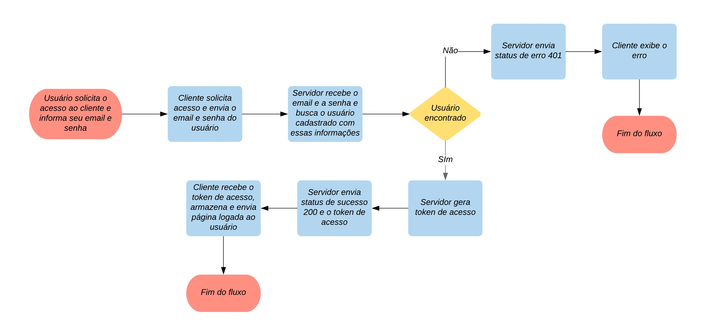

# Logan JavaEE
Desenvolvimento de um login em uma API RESTFull construída em JavaEE usando JWT.

### Tecnologias
1. Java
2. JavaEE
3. Java Web Token (JWT)

### Informações gerais
A prosta deste repositório é apresentar o desenvolvimento de um **login simples** em uma API RESTFull JavaEE, baseada em Token.

O que queremos é que o cliente solicite à API uma credencial de acesso a partir dos seus dados de login (neste caso, email e senha) e receba um token de acesso que deve ser enviado em todas as requisições protegidas da API.

### Desenvolvimento da aplicação
A aplicação foi dividida em duas etapas: a **autenticação** (credenciar o usuário) e **autorização** (verificar se o usuário está autenticado).

#### Autenticação
Para realizar o login, a aplicação se comporta como mostra o diagrama de fluxo da Figura 1 a seguir:

Sabendo disso, essa interação foi dividida nas seguintes classes princiais: 

1. **UsuarioController**: Classe de controle que recebe a requisição do cliente com as informações para acesso do usuário, envia para o serviço fazer a autenticação (gerar token de acesso) e retorna esse token ao cliente (ou o status 401, caso ele não tenha acesso); 

2. **UsuarioService**: Classe de negócio que recebe as credenciais do usuário (email e senha) provindas do controlador e envia para o repositório para buscar o usuário com aquelas credencias. Caso exista um usuário com aquele email e senha, esse serviço chama a classe **JWTUtil** para gerar o token de acesso e envia-o para o controlador. Se não houver um usuário com essas credenciais, retorna uma exceção;

3. **Usuário Repository**: Classe de acesso ao banco de dados que busca e retorna o usuário com o email e senha enviados do serviço;

4. **JWTUtil**: Classe de apoio responsável por gerar e retornar o token de acesso.

O diagrama de comunicação da Figura 2 a seguir, ilustra melhor essa interação.

### Referências
1. https://stackoverflow.com/questions/26777083/best-practice-for-rest-token-based-authentication-with-jax-rs-and-jersey
2. https://pt.linkedin.com/pulse/autentica%C3%A7%C3%A3o-baseada-em-token-uma-aplica%C3%A7%C3%A3o-rest-tarcisio-carvalho
3. https://blog.totalcross.com/pt/seguranca-com-jwt-e-java/

